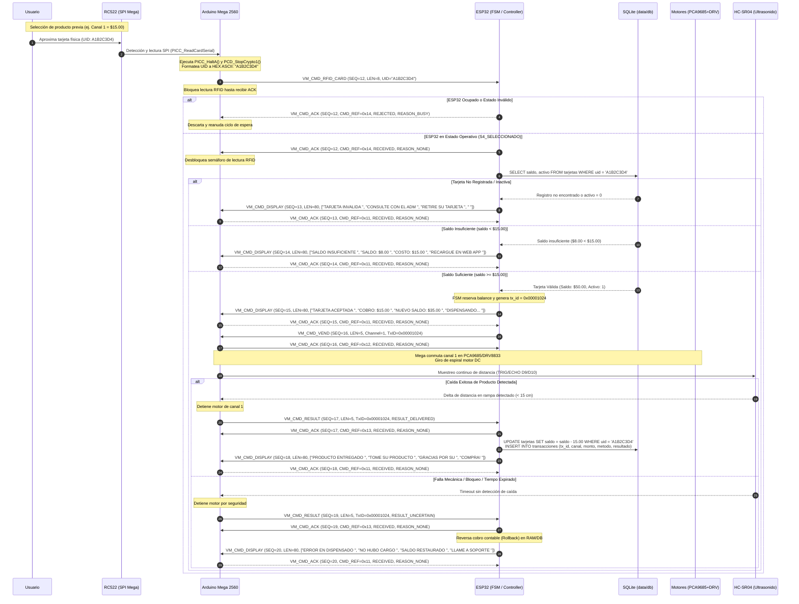

# Registro de Cambios del Protocolo UART: v2.0.0 a v2.1.0
**Proyecto:** Máquina Expendedora Embebida (*Vending Machine*)  
**Arquitectura:** ESP32 (Maestro / Controlador de Negocio) $\longleftrightarrow$ Arduino Mega 2560 (Esclavo / I/O Físico)  
**Fecha de Publicación:** 21 de Septiembre de 2026  
**Estado:** DEFINITIVO / APROBADO  

---

## 1. Resumen General (Overview)

El presente documento detalla la evolución técnica de la interfaz de comunicaciones serie entre el controlador maestro (**ESP32**) y el controlador de periféricos de bajo nivel (**Arduino Mega 2560**), formalizando la transición de la versión **v2.0.0** a la **v2.1.0**.

El incremento de versión a **v2.1.0** obedece a modificaciones físicas y funcionales esenciales en la máquina expendedora:
1. **Ampliación de la interfaz visual:** Migración del visualizador LCD de 16×2 caracteres a un formato de 20×4 caracteres (I2C), incrementando el tamaño de pantalla de 32 a 80 bytes.
2. **Reubicación e integración del lector RFID:** El módulo RFID RC522 se traslada del bus SPI del ESP32 al bus SPI por hardware del Arduino Mega, introduciendo un nuevo comando de enlace (`VM_CMD_RFID_CARD = 0x14`) para la transmisión asíncrona del Identificador Único (UID) de las tarjetas hacia la base de datos local SQLite del ESP32.

> [!WARNING]
> ### Ruptura Estricta de Compatibilidad Binaria
> La transición de v2.0.0 a v2.1.0 constituye un **cambio no compatible hacia atrás (Breaking Change)**. Modifica el tamaño máximo de búfer de recepción y despacho (`VM_MAX_PAYLOAD_LEN`) de 32 a 80 bytes, altera la semántica de trama del comando `DISPLAY` e incorpora nuevos comandos a la FSM.  
> **Ambos firmwares (ESP32 y Arduino Mega) DEBEN ser actualizados y flasheados de forma simultánea.** La coexistencia de firmwares en versiones mixtas provocará el descarte de tramas por desbordamiento de longitud (`INVALID_LENGTH`) o discrepancia de versión (`VM_REASON_VERSION_MISMATCH`) durante la negociación `HELLO`.

---

## 2. Cambios Críticos y Rupturas de Compatibilidad (Breaking Changes)

### 2.1 Incremento de `VM_MAX_PAYLOAD_LEN` de 32 a 80 Bytes

* **Causa técnica:** La sustitución del display LCD de 16×2 por uno de 20×4 demanda que la carga útil transmitida en un único paquete de actualización de pantalla pase de $16 \times 2 = 32$ caracteres a $20 \times 4 = 80$ caracteres ASCII.
* **Impacto en memoria y parsing:**
  * La constante macro `VM_MAX_PAYLOAD_LEN` se redefine formalmente de `32u` a `80u`.
  * El búfer estático interno del parser en la capa de enlace (`_payload[VM_MAX_PAYLOAD_LEN]`) debe ser de 80 bytes en ambos microcontroladores.
  * El tamaño máximo permisible de una trama completa serial (`VM_MAX_FRAME_LEN = VM_HEADER_LEN + VM_MAX_PAYLOAD_LEN`) se eleva de **38 bytes** a **86 bytes** ($6 + 80$).
* **Estructura de cabecera:**
  * El campo `LEN` (longitud de payload) en la cabecera de la trama sigue residiendo en un único byte (`uint8_t`), cuyo rango abarca $0 \dots 255$. Por lo tanto, un valor de `LEN = 80` (0x50) encaja holgadamente sin necesidad de modificar el tamaño ni el alineamiento del encabezado (`VM_HEADER_LEN = 6u` invariante).

```
+--------+--------+---------+--------+--------+--------+-------------------------+
|  SOF1  |  SOF2  |  PROTO  |  CMD   |  SEQ   |  LEN   |   PAYLOAD (0..80 B)     |
| (0xA5) | (0x5A) | (0x02)  | (1 B)  | (1 B)  | (1 B)  |   Datos de comando      |
+--------+--------+---------+--------+--------+--------+-------------------------+
|<----------------- Encabezado: 6 bytes --------------->|<--- Variable (0..80) --->|
|<------------------------ Trama Máxima: 86 bytes --------------------------------->|
```

---

### 2.2 Expansión del Comando `DISPLAY` (`CMD = 0x11`)

* **Dirección:** ESP32 $\longrightarrow$ Arduino Mega (invariable).
* **Definición en v2.0:** Longitud fija `LEN = 32`. Carga útil conformada por:
  $$\text{Payload} = \text{linea}_1[16] + \text{linea}_2[16]$$
* **Definición en v2.1:** Longitud fija `LEN = 80`. Carga útil compuesta por 4 líneas consecutivas de 20 caracteres cada una:
  $$\text{Payload} = \text{linea}_1[20] + \text{linea}_2[20] + \text{linea}_3[20] + \text{linea}_4[20]$$
* **Reglas obligatorias de formateo y saneamiento:**
  1. **Relleno exacto (*Padding*):** Cada una de las 4 líneas debe ser rellenada con espacios ASCII (`0x20`) hasta totalizar de manera exacta 20 bytes por renglón.
  2. **Filtrado de caracteres imprimibles:** Cualquier byte cuyo código caiga fuera del rango ASCII imprimible estándar ($[0\text{x}20, 0\text{x}7\text{E}]$) debe ser sustituido obligatoriamente por el caracter de sustitución `'?'` (`0x3F`).
  3. **Validación de longitud:** Si el Arduino Mega recibe un comando `VM_CMD_DISPLAY` con `LEN != 80`, la trama debe ser descartada inmediatamente y respondida con:
     $$\text{ACK}(\text{CMD\_DISPLAY}, \text{VM\_ACK\_REJECTED}, \text{VM\_REASON\_INVALID\_LENGTH})$$

#### Definición en C/C++ (`vm_uart_protocol.h`):

```c
#define VM_LEN_DISPLAY           80u   // line1[20] + line2[20] + line3[20] + line4[20]
#define VM_DISPLAY_LINE_LEN      20u   // 20 caracteres por renglón
#define VM_DISPLAY_NUM_LINES      4u   // 4 renglones físicos
#define VM_DISPLAY_PAD_CHAR      0x20u // Espacio ASCII de relleno
#define VM_DISPLAY_INVALID_CHAR  0x3Fu // '?' ante caracteres no imprimibles
#define VM_DISPLAY_ASCII_MIN     0x20u // Rango mínimo imprimible
#define VM_DISPLAY_ASCII_MAX     0x7Eu // Rango máximo imprimible

typedef struct {
    char line1[VM_DISPLAY_LINE_LEN];
    char line2[VM_DISPLAY_LINE_LEN];
    char line3[VM_DISPLAY_LINE_LEN];
    char line4[VM_DISPLAY_LINE_LEN];
} vm_payload_display_t;
```

---

### 2.3 Nuevo Comando: `RFID_CARD` (`CMD = 0x14`)

* **Dirección:** Arduino Mega $\longrightarrow$ ESP32.
* **Propósito:** El Arduino Mega detecta físicamente una tarjeta o llavero de proximidad en el transceptor RC522 mediante el bus SPI local, extrae su número de serie/UID (de 4, 7 o 10 bytes según el estándar ISO/IEC 14443-A), lo convierte en una cadena ASCII hexadecimal en mayúsculas y lo transmite de forma asíncrona al ESP32 para su verificación contable y autorización en SQLite.
* **Formato de la Carga Útil (`PAYLOAD`):**
  * `uid_ascii[N]`: Cadena de caracteres ASCII hexadecimales en mayúsculas que representa el UID leído.
  * **No contiene terminador nulo** en la transmisión UART física sobre el cable.
  * Ejemplos representativos:
    * UID de 4 bytes (MIFARE Classic 1K): `A1B2C3D4` $\longrightarrow$ `LEN = 8`
    * UID de 7 bytes (MIFARE Ultralight / NTAG): `04A1B2C3D4E5F6` $\longrightarrow$ `LEN = 14`
    * UID de 10 bytes: `04A1B2C3D4E5F6A7B8C9` $\longrightarrow$ `LEN = 20`
* **Longitud del Payload (`LEN`):**
  * Dinámica/Variable: de $1$ a $20$ bytes (`VM_LEN_RFID_CARD_MIN = 1u`, `VM_LEN_RFID_CARD_MAX = 20u`).
* **Procedimiento Físico Crítico en Arduino Mega:**
  1. Al detectar una tarjeta presente mediante `PICC_IsNewCardPresent()` y leer con éxito su cabecera con `PICC_ReadCardSerial()`, el Mega debe ejecutar de manera inmediata:
     * `mfrc522.PICC_HaltA();` $\longrightarrow$ Suspende la comunicación con la tarjeta actual para evitar lecturas continuas o colisiones.
     * `mfrc522.PCD_StopCrypto1();` $\longrightarrow$ Detiene cualquier encriptación de hardware activa en el transceptor.
  2. Ambas funciones deben llamarse **antes** de ensamblar y despachar el paquete `RFID_CARD` por la UART.
* **Control de Flujo y Prevención de Saturación (Anti-Spam):**
  * El Arduino Mega **NO DEBE** transmitir una nueva trama `RFID_CARD` mientras se encuentre a la espera de la confirmación `ACK` de la tarjeta previa o hasta que ocurra un tiempo de espera de reintento (*ACK Timeout*).
* **Confirmación por parte del ESP32:**
  * Al recibir la trama `RFID_CARD`, el ESP32 responde inmediatamente con:
    * Éxito: $\text{ACK}(\text{RFID\_CARD}, \text{VM\_ACK\_RECEIVED}, \text{VM\_REASON\_NONE})$
    * Rechazo (ej. máquina en modo mantenimiento, dispensando o fuera de servicio):  
      $\text{ACK}(\text{RFID\_CARD}, \text{VM\_ACK\_REJECTED}, \text{VM\_REASON\_INVALID\_STATE})$

#### Definición en C/C++ (`vm_uart_protocol.h`):

```c
#define VM_LEN_RFID_CARD_MIN     1u   // Mínimo 1 byte de UID ASCII
#define VM_LEN_RFID_CARD_MAX    20u   // Máximo 20 bytes (10 bytes UID × 2 chars hex)

typedef struct {
    char uid_hex[VM_LEN_RFID_CARD_MAX + 1]; // UID en hex ASCII + terminador '\0' en RAM
    uint8_t uid_len;                         // Longitud real del string hex (8, 14 o 20)
} vm_payload_rfid_card_t;
```

---

## 3. Diagrama de Secuencia: Flujo de Pago con Tarjeta RFID

A continuación se modela el ciclo de vida completo de una transacción iniciada por proximidad RFID, contrastando el flujo nominal exitoso (*Happy Path*) frente a los escenarios de fallo (saldo insuficiente, tarjeta no registrada o falla mecánica).



---

## 4. Tabla Comparativa de Constantes del Protocolo

A continuación se resume el inventario completo de identificadores y parámetros que sufrieron alteraciones entre la versión **v2.0.0** y la versión **v2.1.0**:

| Símbolo / Macro | Valor v2.0.0 | Valor v2.1.0 | Tipo / Rango | Propósito e Impacto |
| :--- | :---: | :---: | :---: | :--- |
| `VM_HELLO_VERSION_MAJOR` | `2u` | `2u` | `uint8_t` | Versión mayor del protocolo. Se preserva idéntica. |
| `VM_HELLO_VERSION_MINOR` | `0u` | `1u` | `uint8_t` | **Modificada:** Negociada en el comando `HELLO`. Si hay discrepancia, se rechaza la inicialización. |
| `VM_MAX_PAYLOAD_LEN` | `32u` | `80u` | `uint8_t` | **Modificada:** Límite superior de bytes para el campo de carga útil. |
| `VM_MAX_FRAME_LEN` | `38u` | `86u` | `uint8_t` | **Modificada:** Tamaño máximo de la trama completa ($6 + 80$ bytes). |
| `VM_CMD_RFID_CARD` | *Inexistente* | `0x14` | `vm_cmd_t` (0x14) | **Nuevo:** Comando asíncrono Mega $\to$ ESP32 con el UID de tarjeta leído. |
| `VM_LEN_DISPLAY` | `32u` | `80u` | `uint8_t` | **Modificada:** Longitud fija requerida en tramas `VM_CMD_DISPLAY`. |
| `VM_DISPLAY_LINE_LEN` | `16u` | `20u` | `uint8_t` | **Modificada:** Caracteres fijos por renglón en pantalla LCD. |
| `VM_DISPLAY_NUM_LINES` | `2u` | `4u` | `uint8_t` | **Nuevo/Explícito:** Cantidad física de renglones del visualizador. |
| `VM_LEN_RFID_CARD_MIN` | *Inexistente* | `1u` | `uint8_t` | **Nuevo:** Longitud mínima admisible para el payload de `RFID_CARD`. |
| `VM_LEN_RFID_CARD_MAX` | *Inexistente* | `20u` | `uint8_t` | **Nuevo:** Longitud máxima admisible para el payload de `RFID_CARD`. |
| `vm_payload_display_t` | 2 líneas $\times$ 16 B | 4 líneas $\times$ 20 B | `struct` C/C++ | **Modificada:** Estructura en memoria RAM para volcado de interfaz visual. |
| `vm_payload_rfid_card_t` | *Inexistente* | `char[21]`, `len` | `struct` C/C++ | **Nuevo:** Estructura auxiliar para parseo de UID en memoria. |

---

## 5. Justificación y Contexto de Cambios de Hardware

Los ajustes en la capa de protocolo responden a decisiones estratégicas en la arquitectura de hardware y electrónica del sistema:

```
                            +--------------------------+
                            |      ESP32 (WROOM)       |
                            | - Máquina de Estados FSM |
                            | - Base de Datos SQLite   |
                            | - Servidor Web & SoftAP  |
                            +------------+-------------+
                                         |
                                   UART2 | 115200 bps
                                         |
                            +------------+-------------+
                            |   Arduino Mega 2560      |
                            +------------+-------------+
                                         |
       +-----------------+---------------+-----------------+------------------+
       | Bus SPI         | Bus I2C       | Bus I2C         | GPIO Digital     | GPIO Digital
       v                 v               v                 v                  v
+--------------+  +--------------+ +-------------+  +--------------+   +---------------+
| Lector RFID  |  | Display LCD  | | Driver PWM  |  | Sensor Caída |   | Teclado       |
| MFRC522      |  | 20x4 (0x27)  | | PCA9685     |  | HC-SR04      |   | Matricial 4x4 |
| (D50-D53,D8) |  | (SDA20/SCL21)| | (I2C 0x40)  |  | (Trig9/Echo10|   | (Pines 22-29) |
+--------------+  +--------------+ +------+------+  +--------------+   +---------------+
                                          |
                                          v
                                   +-------------+
                                   | Puente H    |
                                   | DRV8833     |
                                   +------+------+
                                          |
                                          v
                                   +-------------+
                                   | Motores DC  |
                                   | Espirales   |
                                   +-------------+
```

### 5.1 Reubicación del Lector RFID RC522 al Arduino Mega
* **Configuración de Pines en Arduino Mega:**
  * `SS` (SDA / CS): **Pin Digital 53** (Hardware SPI Chip Select)
  * `MOSI`: **Pin Digital 51** (Hardware SPI Master Out)
  * `MISO`: **Pin Digital 50** (Hardware SPI Master In)
  * `SCK`: **Pin Digital 52** (Hardware SPI Clock)
  * `RST`: **Pin Digital 8**
* **Justificación técnica:**
  * En la arquitectura original, el ESP32 mantenía el bus SPI dedicado al RC522. Sin embargo, el ESP32 requiere recursos de cómputo intensivo para atender la pila TCP/IP, el servidor HTTP embebido, el almacenamiento en LittleFS y las consultas SQL concurrentes.
  * Al centralizar todos los sensores y periféricos físicos de interacción humana (teclado, RFID, sensores de caída) en el Arduino Mega, el ESP32 queda completamente aislado de las interrupciones de hardware en tiempo real.

### 5.2 Sustitución del Display LCD: 16×2 Paralelo $\longrightarrow$ 20×4 I2C
* **Configuración en Arduino Mega:**
  * Bus I2C: **SDA = Pin Digital 20**, **SCL = Pin Digital 21**
  * Dirección I2C base: `0x27` (o `0x3F` sujeta al jumper del módulo PCF8574T).
* **Justificación técnica:**
  * La interfaz paralela previa de 4 bits demandaba 6 pines digitales directos del microcontrolador. La incorporación del adaptador I2C reduce el consumo a los 2 hilos del bus I2C estándar.
  * El incremento a 4 renglones de 20 caracteres (80 caracteres totales) permite desplegar simultáneamente el nombre del producto, el costo, el saldo remanente tras acercar la tarjeta RFID y mensajes de estado del sistema sin recurrir a desplazamiento marquesina (*scrolling*).

### 5.3 Sistema de Actuación: Servomotores $\longrightarrow$ Motores DC con Driver PCA9685 y DRV8833
* **Configuración:**
  * Controlador PWM I2C: **PCA9685** (Dirección I2C `0x40`).
  * Etapa de Potencia: **DRV8833 Dual H-Bridge**.
* **Justificación técnica:**
  * Los servomotores de modelismo RC sufrían caídas de par, desgaste en piñonería de plástico y fluctuaciones por jitter en la señal PWM.
  * Los motores reductores de corriente continua proporcionan par estable para mover espirales mecánicas pesadas.
  * El PCA9685 genera señales PWM por hardware independiente, liberando los temporizadores internos (*Timers*) del microcontrolador Mega.
  * El circuito integrado DRV8833 ofrece protección contra sobrecorriente (*OCP*), apagado térmico (*TSD*) y frenado electrónico activo para detener la rotación del espiral en el ángulo exacto de entrega.

### 5.4 Detección de Caída: Barrera Óptica $\longrightarrow$ Sensor Ultrasónico HC-SR04
* **Configuración en Arduino Mega:**
  * `TRIG`: **Pin Digital 9**
  * `ECHO`: **Pin Digital 10**
* **Justificación técnica:**
  * La fotocélula infrarroja de ranura presentaba zonas muertas y vulnerabilidad ante la luz solar o paquetes de productos con envoltorios transparentes/negros.
  * El sensor acústico HC-SR04 emite un tren de pulsos ultrasónicos a 40 kHz en la rampa receptora, garantizando la detección del cambio de volumen o distancia ante cualquier objeto que caiga en la tolva de despacho, independientemente de sus propiedades ópticas.

### 5.5 Teclado Matricial 4×4
* **Configuración:**
  * Pines Digitales D22 a D29 (Filas D22-D25, Columnas D26-D29).
  * **Sin cambios:** Permanece con barrido matricial y antirrebote (*debouncing*) en el Arduino Mega, despachando eventos mediante `VM_CMD_KEY = 0x10`.

---

## 6. Lista de Verificación para Migración (Migration Checklist)

Para garantizar una transición sin fallos ni estados inconsistentes entre ambos nodos, siga estrictamente el siguiente procedimiento escalonado:

- [ ] **1. Unificación del Archivo de Protocolo (`vm_uart_protocol.h`)**
  - [ ] Reemplazar el archivo `vm_uart_protocol.h` en ambos repositorios/proyectos con la versión 2.1 idéntica.
  - [ ] Verificar que `VM_HELLO_VERSION_MINOR` esté establecido en `1u`.
  - [ ] Verificar que `VM_MAX_PAYLOAD_LEN` esté fijado en `80u`.
  - [ ] Comprobar que el comando `VM_CMD_RFID_CARD = 0x14` esté incluido en el enum `vm_cmd_t`.
  - [ ] Confirmar que `VM_LEN_DISPLAY` sea igual a `80u` y `VM_DISPLAY_LINE_LEN` a `20u`.

- [ ] **2. Actualización de la Capa de Enlace (`VmUartLink`)**
  - [ ] Constatar que el búfer `_payload` posea una capacidad de `VM_MAX_PAYLOAD_LEN` (80 bytes).
  - [ ] Ajustar la función estática `expectedPayloadLen(uint8_t cmd)` para retornar `VM_LEN_DISPLAY` (80) ante `VM_CMD_DISPLAY`, y considerar la naturaleza de longitud variable (1 a 20) de `VM_CMD_RFID_CARD`.
  - [ ] Actualizar la sobrecarga de `sendDisplay` para recibir las 4 líneas de 20 caracteres:
    ```cpp
    void sendDisplay(uint8_t seq,
                     const char line1[VM_DISPLAY_LINE_LEN],
                     const char line2[VM_DISPLAY_LINE_LEN],
                     const char line3[VM_DISPLAY_LINE_LEN],
                     const char line4[VM_DISPLAY_LINE_LEN]);
    ```
  - [ ] Implementar la función auxiliar de despacho para RFID:
    ```cpp
    void sendRfidCard(uint8_t seq, const char* uidHex, uint8_t len);
    ```

- [ ] **3. Implementación en Firmware de Arduino Mega 2560**
  - [ ] Migrar el bus SPI del RC522 a los pines de hardware D50 (MISO), D51 (MOSI), D52 (SCK), D53 (SS) y D8 (RST).
  - [ ] Implementar la lectura no bloqueante del RC522 dentro de `loop()`.
  - [ ] Llamar obligatoriamente a `mfrc522.PICC_HaltA()` y `mfrc522.PCD_StopCrypto1()` inmediatamente después de extraer el UID de la tarjeta.
  - [ ] Formatear el UID a texto hexadecimal en mayúsculas (ej. `snprintf(...)`).
  - [ ] Implementar control de flujo: bloquear el envío de nuevas tramas `RFID_CARD` hasta recibir el `ACK` correspondiente del ESP32 o cumplir timeout.
  - [ ] Reemplazar la librería LCD anterior por `LiquidCrystal_I2C` inicializada en dirección `0x27` (20 columnas $\times$ 4 filas).
  - [ ] Modificar el manejador de `VM_CMD_DISPLAY` para volcar los 80 bytes recibidos a lo largo de las 4 líneas físicas del display I2C.
  - [ ] Incorporar el control de motores mediante PCA9685 y el sensado de caída ultrasónico con HC-SR04.

- [ ] **4. Implementación en Firmware de ESP32**
  - [ ] Extender el despachador de tramas en `VmEsp32Controller::handleIncomingFrame()` para capturar `VM_CMD_RFID_CARD`.
  - [ ] Validar longitud de payload ($1 \le \text{LEN} \le 20$): responder `VM_REASON_INVALID_LENGTH` si es erróneo.
  - [ ] Responder `ACK(VM_CMD_RFID_CARD, VM_ACK_RECEIVED)` de forma inmediata si el estado del sistema lo permite; responder `VM_REASON_BUSY` o `VM_REASON_INVALID_STATE` si la máquina está dispensando.
  - [ ] Conectar la recepción del UID con la lógica de negocio de la FSM central (`vm_fsm`):
    - Consultar saldo y estado de habilitación en la tabla `tarjetas` de la base de datos SQLite embebida.
    - Gestionar el cobro contable o notificar fallo de crédito en la interfaz visual.
  - [ ] Actualizar el método `updateDisplay()` para aceptar 4 cadenas de texto y padearlas a 20 caracteres cada una.

- [ ] **5. Verificación en Banco de Pruebas Integrado (QA)**
  - [ ] Realizar ciclo de encendido simultáneo y confirmar que el apretón de manos `HELLO` reporte versión `2.1` con resultado `VM_ACK_RECEIVED`.
  - [ ] Comprobar que si se carga un ESP32 con v2.0 y un Mega con v2.1, el handshake sea rechazado con `VM_REASON_VERSION_MISMATCH`.
  - [ ] Aproximar tarjeta RFID registrada y corroborar la recepción del UID, el cobro en base de datos SQLite y la activación del canal de dispensado.
  - [ ] Validar que un display de 4 líneas muestre la información completa sin caracteres truncados ni corrimientos de memoria.
